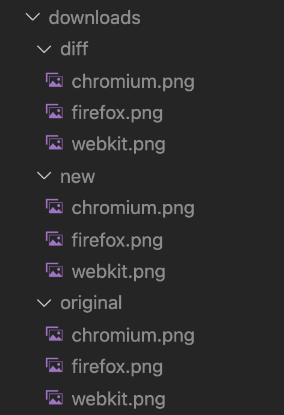
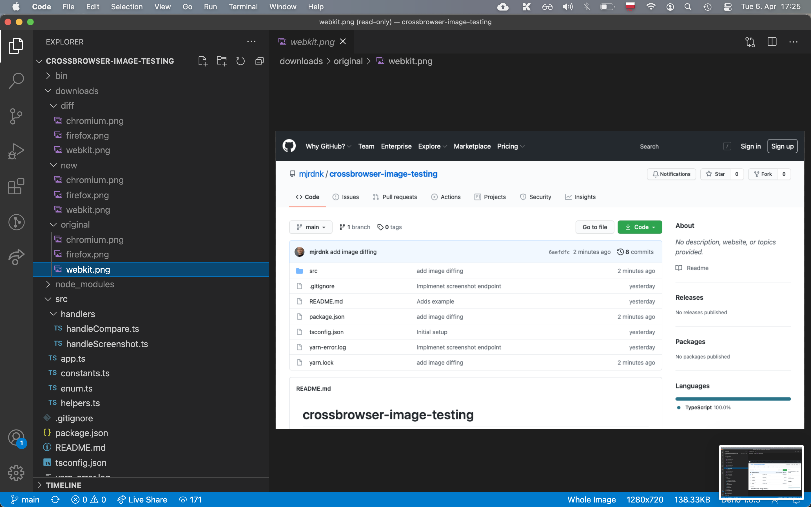
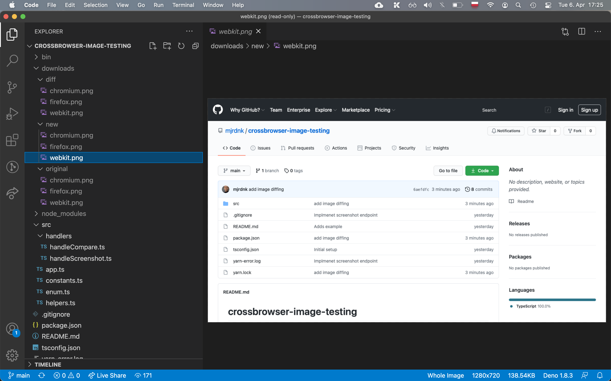
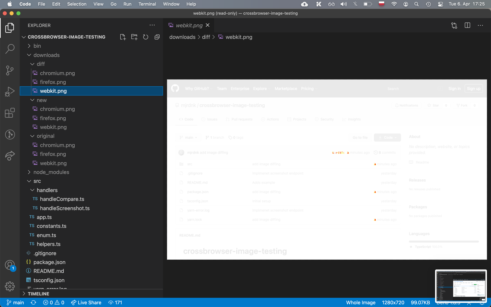

# crossbrowser-image-testing

Automates comparing web pages to see if the version changed. Can be useful for visual testing automation.

## supported browsers: chromium, firefox, webkit

Run locally: `yarn && yarn dev`

## Endpoints:

### GET /screenshot

Calling this endpoint will create a snapshot of the specified url in one of the possible directories: `downloads/original/` or `downloads/new/` (if `retake`).

#### query params:

| Query param | Required |  Type   | Description                                              | Example                                              |
| ----------- | :------: | :-----: | :------------------------------------------------------- | :--------------------------------------------------- |
| url         |   Yes    | string  | Valid url to take a screenshot and eventually to compare | https://github.com/mjrdnk/crossbrowser-image-testing |
| retake      |    No    | boolean | Will retake the image (puts it in new/ directory)        | 1                                                    |

### GET /compare

Prerequisites: new and original images are screenshot and sitting in `original/` and `new/` directories in the project root under `downloads/`.
Calling this endpoint will create a diff between `new/` and `original/` image of each browser type, and will place the diffs in `diff/` directory.

### Visual explanation

#### File Tree after correct execution of 2 endpoints

#### original image (hence commit time for example 2 minutes)

#### new image (hence commit time for example 3 minutes)

#### diff image (red spots indicating where the image has changed)

